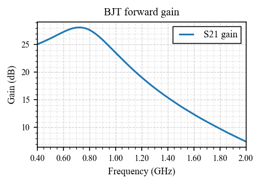
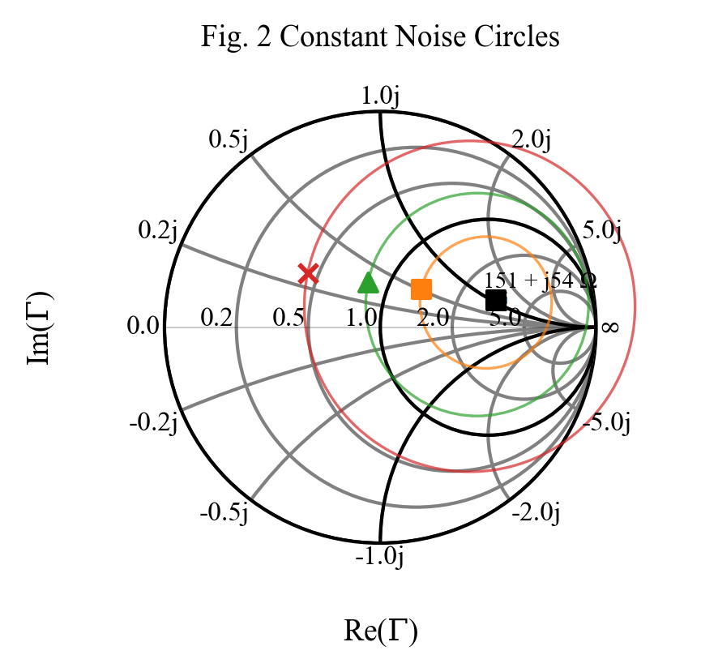
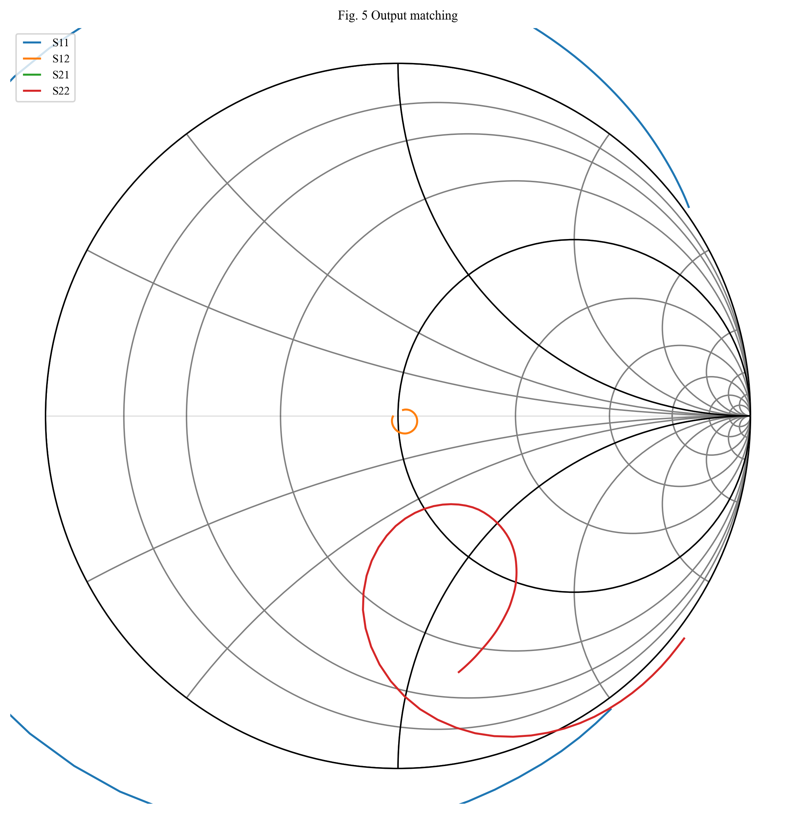

# skrf-LNA
Python script that automates the design of an LNA amplifier

Update Nov 2025: It is functional now but bugs may happen.
I updated the way the Smith chart is created in order to make it compliant with IEEE journal requirements.
Also rectangular graphs are formatted to meet IEEE journal requirements.
Output network calculations is a mess but it works as long as the output impedance is not "weird".
Noise calculations should be fine now.
I never checked the calculated results against a commercial RF simulator so verify every result you get with this script.

TODO: I want to have all calculations and graphs in some sort of htmls report for easy printing.
Output matching calculations are basic at the moment. Need to be improved together with stability analysis.
Add a plot that shows constant gain circles at user specified frequency set, usually three points, before the mathing network is created.

Expect bugs, expect units to be mixed up, expect unexpected.

I run it in a Spyder window (WinPython package) and use the following package versions:

Name: scikit-rf   Version: 1.8.0
Python v 3.8

Edit the following section in "lnacalc.py" before you run the script:
```markdown
# ##================================================###
# ## User defined input                             ###
# ##================================================###
f = freq.Frequency(0.4, 2, 101, 'ghz')
Z0 = 50
tem = DistributedCircuit(f, z0=Z0)
fuser = 900e+6  # frequency of interest for user in Hz
s2p_filename = 'BFU725F_2V_5mA_S_N.s2p'
# s2p_filename = 'BFU520_05V0_010mA_NF_SP.s2p'
plot_inline = False
plot_save = False
# ##================================================###


Example output:





```markdown
```text

runfile('D:/Work/skrf-LNA-main/lnacalc.py', wdir='D:/Work/skrf-LNA-main')
Info: Images will not be ploted inline.
Info: Images will not be saved to file.
============================================================
2-Port Network: 'BFU725F_2V_5mA_S_N',  0.4-2.0 GHz, 101 pts,
		 z0=[50.+0.j 50.+0.j]
============================================================

✓ Model file loaded: BFU725F_2V_5mA_S_N.s2p

S-parameters @ 900.00 MHz:
  S11  = 0.892∠-42.7° (-0.99 dB)
  S21  = 13.277∠147.1° (22.46 dB)
  S12  = 0.037∠64.1°
  S22  = 0.918∠-27.2°

Stability analysis:
  K = 0.118
  |Δ| = 0.868
  Status: UNSTABLE (needs to be stabilized)

✓ Noise parameters loaded.

Gamma opt (min. noise) @ 900.00 MHz:
  S11  = 0.551∠13.2° (-5.18 dB)
  Zopt = 150.9+54.4j Ω

============================================================
INPUT
============================================================
Network name            BFU725F_2V_5mA_S_N
Network frequency    =  0.4-2.0 GHz, 101 pts
Network Z0           =  (50+0j) ohm
Freq user [Hz]       =  900000000 Hz
Z_opt [ohm]          =  150.9+54.4j Ω
NFmin [dB]           =  0.416 dB
Noise Temp.          =  83.631 Kelvin
Gamma_opt            =  0.536+0.126j
gamma_opt_mag        =  0.551
gamma_opt_ang        =  13.177 deg
Gain max [dB]        =  51.181 dB
Gain stable max [dB] =  51.181 dB
K -stab. factor      =  0.118
S11 [dB]             =  -5.2 dB
............................................................

Dopasowanie: Z1 = 50.00 + j0.00 Ω -> Z2 = 150.88 + j-54.37 Ω
  L_series = 12.62 nH
  C_shunt = 1.67 pF
Z_opt =  150.9+54.4j Ω

✓ Input matching network created!
  Topology: L-network (series L/C, shunt C)
  Q = 1.42

✓ Input Matching network successfully connected to BJT
  Partial LNA (INPUT MATCHING + BJT): 2-Port Network: '',  0.4-2.0 GHz, 101 pts, z0=[50.+0.j 50.+0.j]

Result @ 0.90 GHz:
  S11 = -1.43 dB
  |Γ_in| = 0.848
  S21 = 23.86 dB

✗ Warning: Network (INPUT MATCHING + BJT) potentially unstable!
   Calculating output matching anyway.

Dopasowanie: Z1 = 50.00 + j0.00 Ω -> Z2 = 200.75 + j78.97 Ω
  L_series = 15.42 nH
  C_shunt = 1.54 pF

✓ Output matching network created!
  Topology: L-network (series L/C, shunt C)
  Q = 1.74

✓ Output Matching network successfully connected to BJT
  Complete LNA (INPUT MATCHING + BJT + OUTPUT MATCHING): 2-Port Network: '',  0.4-2.0 GHz, 101 pts, z0=[50.+0.j 50.+0.j]

Result @ 0.90 GHz:
  S22 = 3.24 dB
  |Γ_in| = 1.453
  S21 = 25.99 dB
============================================================
OUTPUT
============================================================
Network name:               BFU725F_2V_5mA_S_N
Network frequency:          0.4-2.0 GHz, 101 pts
Network Z0:                 (50+0j) ohm
Freq user [Hz]:             900000000 Hz
Optimum gamma load:         0.816+0.419j
Amplifier NF [dB]:          0.439 dB
Amplifier gain @ fuser      -394.4 dB
Load impedance [ohm]:       200.749-78.973j
Parallel capacitance [F]:   1.5363887584456304
Series iinductor [H]:       15.421407103589237
............................................................
Info: Generated a total of 2 plots.
